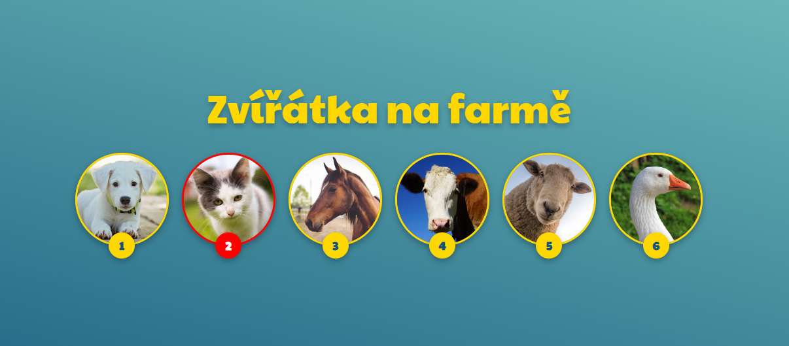

# Zvířátka na farmě

Tvým úkolem je vytvořit tzv. *soundboard*. Aplikaci, která při stisku kláves 1-6 přehraje zvuk příslušného zvířátka a zvýrazní dané zvíře na stránce.

## Tvůj úkol je následující

1. V HTML máš připravenou hotovou strukturu včetně vložených obrázlů a zvuků. Nakóduj v CSS vzhled podle obrázku zadání. Pokud chceš, můžeš si
udělat vzhled i vlastní. I když se teď učíme hlavně JavaScript
nesmíme to CSS zapomenout :)

2. V JavaScriptu napiš program, který zařídi, že se při stisknutí klávesy 1 až 6:
   - přehraje zvuk příslušného zvířete
   - nějakým způsobem se zvýrazní hrající zvíře. Pokud vytváříš vzhled přesně podle zadání (a nevymýšlíš si svůj), můžeš např. změnit žlutý rámeček kolem zvířátka na červený.

3. **Zvýraznění zvířátka**

   Nejlepší bude, když si v CSS připravíš nějakou hotovou třídu, která obude obsahovat např. nastavení rámečku na jinou barvu, a ty budeš tuto třídu na HTML prvek zvířátka jen přidávat.

4. **Přehrání zvuku**

   Při aktivaci zvířátka klávesou (nebo i myší, pokud se do toho chceš pustit) přehraj zvuk z `<audio>` elementu, který má v HTML `id="zvuk-x"` (kde x je číslo zvířete).

	 Audio element pro konkrétní zvíře stačí v JavaScriptu najít pomocí `document.querySelector`, uložit si ho třeba do proměnné `zvuk` a pak zvuk přehráz zavoláním metody `zvuk.play()`

	 Dokumentaci k ovládání audio elementu JavaScriptem najdeš třeba na [W3Schools](https://www.w3schools.com/tags/ref_av_dom.asp) nebo [MDN](https://developer.mozilla.org/en-US/docs/Web/HTML/Element/audio) (lepší, ale techničtější).

	 Pro tento úkol tě ale zajímá v podstatě jen motoda `play()`, p59padn2 metoda `pause()`, kdybys chtěla zvuk zastavit.

5. **Aktivace/deaktivace zvířátka**

	 Pro přehrání zvuku a zvýraznění zvířatka můžeš použít událost `keydown`. Zároveň budeš chtít, aby se při uvolnění klávesy zvířatko na stránce zase odbarvilo, tj. uvedlo do původního nezvýrazněného stavu. K tomu můžeš využít událost `keyup` (uvolnění klávesy), ve které dříve přidanou třídu ze zvířatka zase odebereš.

	 Zvuk po puštění klávesy zvuk nezastavuj, ale nech ho hrát, ať si uživatel stránky pořádně užije :)

## Bonusové úkoly

Když budeš mít vše hotové a budeš si chtít dále hrát, můžeš:

6. Buď kreativní a přidej si vlastní obrázky nebo zvuky.

7. Zvířatka nemusí reagovat jen na stisk klávesy, ale půjde na ně i klikat.

8. Není to nutné, ale když na zvířátka půjde zároveň i klikat,
bude to super!